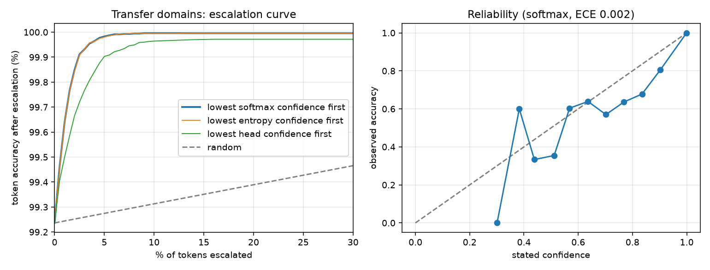

# cascade-search

A search bar that knows when it doesn't know. Demo: [cascade.scira.ai](https://cascade.scira.ai).

A 27,193-parameter model parses search queries in the browser in about a quarter of a millisecond. It gives every word a role and a calibrated confidence. Words it is unsure about, and only those, go to [Jev](https://docs.typesafe.ai/introduction), TypeSafe's System One model, for a typed decision with probabilities. Both tiers feed one compiler, so the app receives the same filter type no matter which tier answered, and nothing in the chain ever parses a string a model wrote.

```ts
import { parse, escalate } from 'cascade-search'
import { createJev } from 'cascade-search-jev'

const result = parse('open bugs from sam since tuesday', schema)

result.ir             // { where: [status = open, type = bug, author = sam, created >= tuesday], ... }
result.minConfidence  // 0.99
result.spans          // [] when nothing needs a second opinion

if (result.spans.length) {
  const final = await escalate(result, schema, createJev())
}
```

The same query language asks for a chart or a number:

```ts
parse('pie chart of open bugs by priority', schema).ir.view
// { chart: 'pie', by: 'priority', agg: 'count', of: null }

parse('how many bugs closed last month', schema).ir.view
// { chart: 'number', by: null, agg: 'count', of: null }

parse('total points per assignee', schema).ir.view
// { chart: 'bar', by: 'assignee', agg: 'sum', of: 'points' }
```

`view` is `null` for an ordinary search. The kinds are `bar`, `pie`, `line` and `number`; grouping by a date field defaults to a line, anything else to bars. In "bugs by sam by status" the first "by" is the author field and the second is the grouping, which is the kind of word that comes back with low confidence and goes to Jev. The library only describes the view; drawing it is the app's job (the demo's is 150 lines of SVG, no chart library).

A 20-second recording of one query staying local and one going to Jev, against the live API: [docs/media/m0-local-then-jev.webm](docs/media/m0-local-then-jev.webm).

## How it works

```
keystroke
   |
[tokenizer + sparse features]     mechanical and schema-agnostic
   |
[micro-model: role + confidence per word]     TypeScript on CPU, WGSL for batches
   |
   |-- every word above the threshold --> [compile filter] --> app
   |
   '-- some word below it --> [span extractor: the unsure words plus two neighbours]
                                    |
                              [Jev, through Vercel AI Gateway]     typed choice, probabilities out
                                    |
                              [merge: the more confident tier wins, per word]
                                    |
                              [compile filter] --> app
                                    |
                              [escalation log] --> next training run
```

Three rules hold the design together.

**Field names never reach a model.** The featurizer reports that a word "matched a field of kind person" or "matched a value of a category", never which one. That is why the model works on schemas it has never seen, and why you can rename every field to nonsense in the demo and the parse does not change.

**The filter IR is the only contract.** Neither tier writes a filter. Each one assigns roles to words. `compile(roles, schema)` is the single place a filter is built.

**Confidence is a calibrated probability, from both tiers.** That makes them comparable. When Jev answers a span, its role replaces the local one only where Jev's probability is higher than the local model's was. This one rule moved live accuracy more than any prompt change: Jev's coin-flip answers stopped overwriting correct local roles.

## Results

All numbers are reproducible from this repo. The corpus is synthetic; read the caveats.

### The local tier alone

4,000 generated queries per split, int6 weights as shipped, measured 2026-09-18 in Node on an Apple laptop. About one query in five asks for a chart or a number; those are scored on the whole filter including the view.

| Split | Exact filter | Word roles | p50 | p99 |
| --- | --- | --- | --- | --- |
| Held out, training domains | 94.70% | 99.34% | 0.28 ms | 0.66 ms |
| Transfer, four unseen domains | 94.35% | 99.29% | 0.28 ms | 0.65 ms |

On the transfer set, chart queries compile exactly 93.9% of the time and plain filters 94.5%. The three chart roles account for 2 of the word errors in 4,000 queries; the rest are the old ones, mostly bare names and topics.

Transfer domains (contacts, music, recipes, shipments) share no field word, alias, enum value, person name, or topic word with the training domains (issues, mail, files, commits). A test enforces that.

### The escalation curve



On the transfer set, escalating the least confident **0.60%** of words reaches 99.5% word accuracy. Choosing words at random needs **35%**. That gap is the reason this project exists.

| Confidence signal | ECE | AUROC | Words escalated for 99.5% |
| --- | --- | --- | --- |
| Temperature-scaled softmax (shipped) | 0.0024 | 0.988 | 0.60% |
| Entropy | 0.0053 | 0.988 | 0.61% |
| Learned confidence head | 0.0021 | 0.961 | 1.01% |

The plan's main technical bet was a learned confidence head. It lost to plain temperature scaling on both calibration and ranking, so temperature scaling ships. The signal is chosen on held-out data from the training domains, never on the transfer set reported here.

### With live Jev

600 transfer queries, real calls through Vercel AI Gateway, 2026-09-18. 223 distinct calls, 8 of which failed and fell back to the local answer. A call averaged 1,173 input tokens (the role guide grew by three roles); output is free.

| Threshold | Exact filter | Queries that wait | Words sent | Jev cost per 1k queries |
| --- | --- | --- | --- | --- |
| 0 (local only) | 93.33% | 0% | 0% | $0 |
| 0.90 | 96.17% | 11.8% | 1.49% | $0.0058 |
| **0.95 (default)** | **97.00%** | 15.0% | 1.91% | $0.0074 |
| 0.97 | 97.17% | 17.7% | 2.27% | $0.0088 |
| 0.99 | 97.17% | 25.5% | 3.44% | $0.0133 |

Jev closes a little more than half of the gap to a perfect second tier on this corpus. Some of its "misses" are arguably our labels being wrong: it calls `than` an operator where the generator calls it noise.

The default of 0.95 minimizes expected cost under stated assumptions: $0.042 per million input tokens, $0.002 for a wrong filter, $0.0002 for a query that waits on the network. Change them in `eval/threshold.ts` and rerun.

### The feedback loop

Every escalation is a labelled example from a stronger model. The demo logs them in the browser, `training/from_log.ts` turns an export into training rows, and the next run includes them.

**This measurement is simulated, and was taken on the v0.1 model** (before charts and the fuzzy-match fix). No real visitors yet. "Traffic" is the issues domain with habits the training corpus lacks: a teammate's bare first name up front, and the team's own slang. The second tier is a stand-in that is right 90% of the time. 3,000 logged queries produced 1,623 escalations; the before and after use 3,000 different queries.

| At threshold 0.97 | Before | After one cycle |
| --- | --- | --- |
| Queries that escalate | 53.9% | 50.0% |
| Words sent | 8.57% | 7.18% |
| Local exact filter | 49.8% | 51.8% |
| Transfer ECE (calibration check) | 0.00310 | 0.00310 |
| Words escalated for 99.5% on transfer | 1.23% | 1.27% |

Escalation drops and calibration holds, so the loop works, but the gain is small, and it is worth being clear about why. The model has no vocabulary. It can learn that in this app a leading unknown word is usually a person, which shifts a prior. It cannot learn that "zed" is a person. Most of what Jev resolves here stays Jev's job. Reproduce with `node eval/feedback.ts log`, `training/pipeline.sh --extra data/escalations.jsonl`, `node eval/feedback.ts measure`, then `training/pipeline.sh --restore`.

### Size and parity

- `cascade-search`, built, weights included: **35.6 KB Brotli** against a 40 KB gate in CI.
- The TypeScript path matches PyTorch, and the WGSL path matches TypeScript, within 1e-3 on every logit with zero role disagreements. Measured in Chrome on Apple silicon: 2.4e-6, and the WGSL kernel ran 1,024 queries about 11 times faster than the CPU path.

## Caveats

- **The corpus is synthetic.** These numbers show the model learned our generator's grammar and carries it to unseen vocabularies. They do not establish accuracy on how people really phrase things. The escalation log exists to fix that.
- English only. One-word terms only: `in-progress`, not `in progress`.
- Dates stay as phrases in the IR (`created >= "last week"`). Resolving them is the app's job; the demo has a small resolver.
- The demo's per-address budget lives in the edge function's memory, so it resets on cold start. Enough to stop a runaway tab, not an abuse system.
- The demo site uses React and shadcn/ui. Its JavaScript is about 215 KB gzipped, several times the model. The plan asked for the site to be smaller than the model; we traded that away for a real component library.

## Repository

```
packages/core     the runtime: tokenizer, features, model, WGSL kernel, IR, compiler
packages/jev      the escalation client: prompt, budget, timeout, structured errors
apps/website      the demo: a Raycast-style window over 2,000 sample issues
training          generator (TypeScript) and training, evaluation, export (PyTorch)
eval              end-to-end accuracy, threshold sweep, size gate, feedback loop
```

The query generator is TypeScript, not Python, on purpose. It calls the same `featurize` the runtime ships, so there is exactly one implementation of the features and nothing to keep in sync.

## Reproducing

```bash
pnpm install
pnpm test                 # compiler oracle, IR round trip, PyTorch/TS/WGSL parity, Jev client
pnpm lint && pnpm typecheck

training/pipeline.sh      # corpus -> train -> calibrate -> int6 export (needs uv)
node eval/e2e.ts
node eval/threshold.ts
node --env-file=.env.local eval/threshold.ts --live 600   # needs AI_GATEWAY_API_KEY

pnpm dev                  # the demo; reads AI_GATEWAY_API_KEY from .env.local
```

One turn of the feedback loop, from a log exported by the demo:

```bash
node training/from_log.ts escalations.json
training/pipeline.sh --extra data/escalations.jsonl
```

## License

MIT
